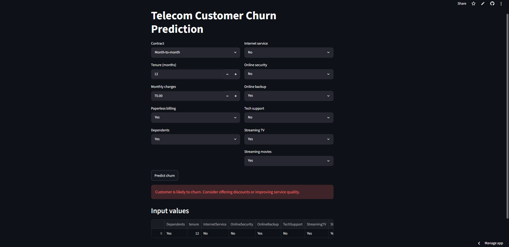
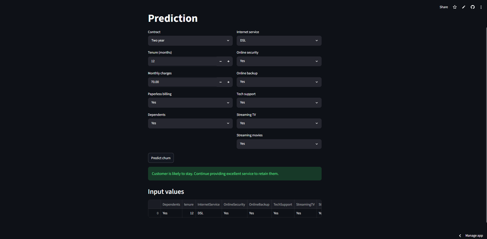

# Telecom Customer Churn Prediction

## Overview

Customer churn prediction is a critical business problem in the telecommunications industry. Churn occurs when customers discontinue a company's services, leading to revenue loss and increased customer acquisition costs.

This project develops a machine learning model to predict whether a customer is likely to churn based on customer demographics, service subscriptions, and account information. Multiple machine learning algorithms were trained, evaluated, and compared to identify the most suitable model for churn prediction.

---

## Live Demo

**Streamlit Application:**

https://telecom-customer-churn-prediction-rs8izdnjqqza6ncikrnnyt.streamlit.app/

---

## Dataset

The project uses the Telco Customer Churn Dataset, which contains customer demographics, account information, and subscribed services.

### Target Variable

**Churn**

* 1 → Customer Churned
* 0 → Customer Retained

### Original Features

* customerID
* gender
* SeniorCitizen
* Partner
* Dependents
* tenure
* PhoneService
* MultipleLines
* InternetService
* OnlineSecurity
* OnlineBackup
* DeviceProtection
* TechSupport
* StreamingTV
* StreamingMovies
* Contract
* PaperlessBilling
* PaymentMethod
* MonthlyCharges
* TotalCharges
* Churn

---

## Exploratory Data Analysis (EDA)

The following visualizations were performed to understand customer churn patterns:

* Churn Distribution
* Churn by Contract Type
* Churn by Internet Service

### Key Insights

* The dataset contains more non-churned customers than churned customers.
* Customers with month-to-month contracts exhibit a significantly higher churn rate than customers with one-year or two-year contracts.
* Churn behavior varies across internet service types, indicating that service-related factors influence customer retention.

---

## Data Preprocessing

### Data Cleaning

The following preprocessing steps were performed:

* Converted the target variable (`Churn`) into numerical format:

  * Yes → 1
  * No → 0
* Removed duplicate records.
* Removed unnecessary columns:

  * customerID
  * TotalCharges

### Feature Selection

Based on exploratory analysis and model experimentation, the following features were removed:

* PaymentMethod
* SeniorCitizen
* Partner
* DeviceProtection
* gender
* PhoneService
* MultipleLines

### Features Used for Training

#### Categorical Features

* Dependents
* InternetService
* OnlineSecurity
* OnlineBackup
* TechSupport
* StreamingTV
* StreamingMovies
* Contract
* PaperlessBilling

#### Numerical Features

* tenure
* MonthlyCharges

---

## Feature Engineering

### Categorical Encoding

Categorical variables were encoded using:

* OneHotEncoder
* drop='first'
* handle_unknown='ignore'

### Feature Scaling

Numerical variables were standardized using:

* StandardScaler

---

## Train-Test Split

The dataset was divided into:

* Training Set: 80%
* Testing Set: 20%

```python
train_test_split(
    X,
    y,
    test_size=0.2,
    random_state=42
)
```

---

## Models Evaluated

The following machine learning algorithms were trained and compared:

### 1. Logistic Regression

* Class-balanced Logistic Regression
* Implemented using a Scikit-Learn Pipeline

### 2. Random Forest Classifier

* Ensemble learning algorithm
* Evaluated for performance comparison

### 3. XGBoost Classifier

* Gradient boosting algorithm
* Evaluated for performance comparison

---

## Model Comparison

All models were evaluated using the same train-test split.

| Model               | Accuracy | Churn Recall |
| ------------------- | -------- | ------------ |
| Logistic Regression | 75.16%   | 82%          |
| Random Forest       | 77.08%   | 47%          |
| XGBoost             | 75.51%   | 73%          |

### Model Selection

Although Random Forest achieved the highest overall accuracy, it struggled to identify churned customers, achieving a recall of only 47% for the churn class.

Logistic Regression achieved the highest churn recall (82%), making it more effective at identifying customers who are likely to leave the service.

Since the primary objective of this project is customer churn prediction and retention, Logistic Regression was selected as the final model because it provides the best balance between overall performance and the ability to detect at-risk customers.

---

## Machine Learning Pipeline

A Scikit-Learn Pipeline was implemented to combine preprocessing and model training into a single workflow.

### Pipeline Components

#### ColumnTransformer

* OneHotEncoder for categorical features
* StandardScaler for numerical features

#### Logistic Regression

```python
LogisticRegression(class_weight='balanced')
```

This pipeline ensures consistent preprocessing during both training and prediction.

---

## Final Model Performance (Logistic Regression)

### Accuracy

**75.16%**

### Confusion Matrix

| Actual / Predicted | No Churn | Churn |
| ------------------ | -------- | ----- |
| No Churn           | 754      | 282   |
| Churn              | 68       | 305   |

### Classification Report

| Class        | Precision | Recall | F1-Score |
| ------------ | --------- | ------ | -------- |
| No Churn (0) | 0.92      | 0.73   | 0.81     |
| Churn (1)    | 0.52      | 0.82   | 0.64     |

### Performance Summary

* Accuracy: 75.16%
* Churn Recall: 82%
* Churn Precision: 52%

A high recall for churned customers is desirable because it enables businesses to identify customers who are likely to leave and take proactive retention measures.

---

## Feature Importance Analysis

The coefficients from the Logistic Regression model were extracted and analyzed to understand feature influence on churn prediction.

* Positive coefficients indicate an increased probability of churn.
* Negative coefficients indicate a reduced probability of churn.

This analysis provides valuable insights into the customer characteristics that contribute most strongly to customer retention and churn behavior.

---

## Model Saving

The final trained pipeline was saved using Joblib:

```python
joblib.dump(pipe, "churn_model.pkl")
```

The saved model can be directly loaded for deployment and prediction.

---

## Deployment

A Streamlit application was developed to provide an interactive interface for churn prediction.

### Features

* User-friendly interface
* Real-time churn prediction
* Automated preprocessing through the saved pipeline
* Instant prediction results

Users can enter customer information and receive churn predictions directly through the web application.

---

## Application Screenshots

### Customer Predicted as Churn



### Customer Predicted as No Churn



---

## Technologies Used

* Python
* Pandas
* NumPy
* Matplotlib
* Seaborn
* Scikit-Learn
* XGBoost
* Joblib
* Streamlit

---

## Project Structure

```text
Telecom-Churn-Prediction/
│
├── screenshots/
│   ├── churn_prediction.png
│   └── no_churn_prediction.png
├── .gitignore
├── app.py
├── churn_model.pkl
├── README.md
├── requirements.txt
└── WA_Fn-UseC_-Telco-Customer-Churn.csv
```

---

## Future Improvements

* Hyperparameter tuning
* Cross-validation
* Additional feature engineering
* Ensemble learning approaches
* Deep learning models
* Real-time churn monitoring dashboard
* Customer retention recommendation system

---

## Conclusion

This project demonstrates an end-to-end machine learning workflow for telecom customer churn prediction, including data preprocessing, exploratory data analysis, feature engineering, model comparison, deployment, and model interpretation.

Three machine learning algorithms—Logistic Regression, Random Forest, and XGBoost—were evaluated and compared. While Random Forest achieved the highest accuracy, Logistic Regression achieved the highest recall for churned customers, making it the most suitable model for customer retention use cases.

The final solution can help telecom companies identify customers at risk of churn and support data-driven retention strategies through early intervention.
